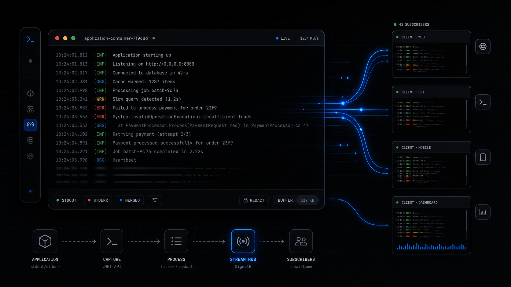

While working on Elsa Studio, I wanted a small way to show live backend console output in the browser.

Not persisted workflow history. Not a full observability platform. Just the raw text a process writes to `Console.Out` and `Console.Error`, with enough guardrails that it can be shown safely in an admin UI.

In our experience building the Studio diagnostics screens, this small distinction mattered: users did not always need a searchable log platform, but they did need immediate feedback while a workflow was running.

That became [Console Log Streaming](https://www.consolelogstreaming.dev/), a small .NET library family for capturing managed stdout and stderr as redacted, line-oriented diagnostics events. The project lives at [github.com/valence-works/console-log-streaming](https://github.com/valence-works/console-log-streaming).



> **Key Takeaways**
> - **Console Log Streaming** is a reusable .NET layer for recent console backfill, live streaming, redaction, and optional persistence.
> - It captures managed `Console.Out` and `Console.Error`; it is not a replacement for platform or container logs.
> - Elsa builds on the same idea in `Elsa.Diagnostics.ConsoleLogs`, where raw output can be correlated with workflow and activity context.

## Why Capture Console Output At All?

The project README describes the problem directly: many .NET apps need an admin-facing view of raw backend console output, but the usual choices are awkward. You can SSH into the host, inspect container logs, build a one-off `Console.SetOut` wrapper, or force everything through `ILogger` and lose raw stdout and stderr semantics.

For workflow hosts, this comes up quickly. A workflow might call an external tool, run a script, invoke an AI agent, start background work, or write quick progress messages while you are debugging. Sometimes the useful diagnostic signal is the raw stream:

```text
Dispatching workflow...
Calling external API...
Waiting for signal...
Workflow resumed.
Completed.
```

Structured logs are still the right choice for queryable application diagnostics. Traces and metrics are still the right choice for distributed observability. But when an operator is watching a workflow run in Studio, the question is often simpler: what did the server just print?

That is the gap Console Log Streaming fills.

## What Does The Standalone Library Provide?

Console Log Streaming separates capture from transport. The core package registers options, redaction, source tracking, an in-memory provider, and an `IConsoleLogCapture` service. ASP.NET Core packages add Minimal API endpoints and SignalR.

The current core registration adds:

- `ConsoleLogOptions`
- line formatting
- metadata access
- redaction pipeline
- source registry
- bounded in-memory provider
- console capture service

The ASP.NET Core convenience package maps both REST-style recent reads and SignalR streaming through `MapConsoleLogStreaming()`. The README documents these defaults:

```text
POST /diagnostics/console-logs/recent
GET  /diagnostics/console-logs/sources
SignalR hub: /hubs/console-logs
```

The hub exposes a streaming method named `StreamAsync`, plus push-style methods: `SubscribeAsync`, `UpdateFilterAsync`, and `UnsubscribeAsync`. That matters for UI work. Some clients want an async stream. Others want the server to push updates through typed client methods.

## What Does Basic Setup Look Like?

For a plain .NET host, the setup is intentionally small:

```csharp
builder.Services.AddConsoleLogStreaming(options =>
{
    options.ServiceName = "orders-api";
    options.RecentCapacity = 5_000;
    options.MaxLineLength = 16 * 1024;
});
```

For a process-wide hosted-service capture model, use the host registration:

```csharp
builder.Services.AddConsoleLogStreamingHost(options =>
{
    options.ServiceName = "orders-worker";
    options.RecentCapacity = 5_000;
});
```

For ASP.NET Core transport:

```csharp
builder.Services.AddConsoleLogStreaming(options =>
{
    options.ServiceName = "orders-api";
});

builder.Services.AddConsoleLogStreamingAspNetCore(options =>
{
    options.AuthorizationPolicy = "diagnostics.console";
    options.RecentPath = "/diagnostics/console-logs/recent";
    options.SourcesPath = "/diagnostics/console-logs/sources";
    options.HubPath = "/hubs/console-logs";
});

var app = builder.Build();

app.MapConsoleLogStreaming();

await app.Services.GetRequiredService<IConsoleLogCapture>().StartAsync();
await app.RunAsync();
```

The library also supports optional SQLite persistence for short-term troubleshooting. That is useful for recent diagnostics across browser reconnects or short host restarts, but it is not meant to become compliance audit storage.

## How Did This Feed Into Elsa?

Elsa 3.8 takes the idea and adds workflow context. The local Elsa source now has `Elsa.Diagnostics.ConsoleLogs`, which registers console log streaming, SignalR, hub authorization, subscription management, shell lifecycle capture, and workflow/activity execution pipeline contributors.

At the backend level, Elsa maps the SignalR hub here:

```text
/elsa/hubs/diagnostics/console-logs
```

The Elsa hub supports `StreamAsync`, `SubscribeAsync`, `UpdateFilterAsync`, and `UnsubscribeAsync`. It also validates time filters and checks read access before streaming.

The important Elsa-specific part is metadata. `ConsoleLogWorkflowExecutionMiddleware` pushes workflow execution context into the console log context accessor. `ConsoleLogActivityExecutionMiddleware` does the same for activity execution, including detached background activity execution. As a result, a line printed while a workflow is running can carry workflow or activity context when that context is available.

That is why this belongs next to [console logs in Elsa 3.8](/blog/console-logs-in-elsa-3-8) and [structured logs in Elsa 3.8](/blog/structured-logs-in-elsa-3-8). They answer different questions:

- Console logs: what did stdout or stderr print?
- Structured logs: what semantic `ILogger` event did the application emit?
- OpenTelemetry diagnostics: what traces, metrics, resources, and OTLP logs does the runtime expose?

The split keeps each diagnostic signal honest.

## What Are The Safety Boundaries?

Console output can contain secrets. The library is designed so managed stdout and stderr writes become line events, then normalization and redaction happen before providers, subscribers, endpoints, SignalR clients, or SQLite persistence see the line.

The README also calls out important limitations:

- Version 1 captures managed .NET `Console.Out` and `Console.Error` writes.
- It does not guarantee capture of native code writing directly to stdout or stderr file descriptors.
- It does not capture output from child processes unless that output is redirected back into the current process and written through managed console writers.
- It should not replace platform or container logs for authoritative process-level capture.

That boundary is exactly why I like it for admin-facing runtime visibility. It is not pretending to be everything. It gives the app a reusable, bounded, redacted stream for the cases where in-app console visibility is enough.

## Where Does It Help?

This is most useful when the UI is already the operator's window into a running process:

- workflow designers
- admin portals
- orchestration dashboards
- internal tools
- background worker dashboards
- support screens for live troubleshooting

For Elsa, the practical value is immediate. If a workflow calls a long-running operation, prints progress, invokes external systems, or runs development-time diagnostics, Studio can show that output without asking the user to inspect a terminal or container log stream.

That does not replace structured observability. It complements it. For longer-term analysis, use structured logs, traces, metrics, and your normal observability stack. For the raw live stream, Console Log Streaming is a focused tool.

## Closing Thoughts

Console output is not glamorous, but it is often the first thing a developer or operator wants to see.

Console Log Streaming turns that raw stream into a reusable .NET primitive: bounded, redacted, filterable, and transportable. Elsa uses the same design pressure in its diagnostics module, then adds workflow and activity context so the output makes sense inside Studio.

That is the useful boundary. Keep raw console output raw, make it safe enough to view remotely, and connect it to the runtime context the operator already cares about.
