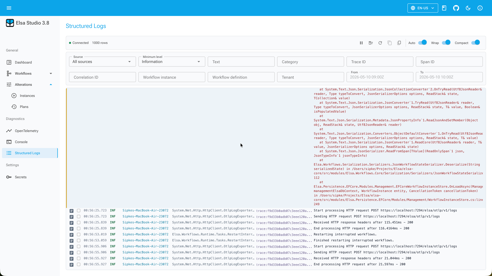

# Structured Logs in Elsa 3.8: Operator Guide

Elsa 3.8 preview 1 adds `Elsa.Diagnostics.StructuredLogs`, an opt-in diagnostics module for semantic `ILogger` events. The module sits beside console logs and OpenTelemetry diagnostics; it does not replace either one ([Elsa 3.8 Preview 1](/blog/elsa-3-8-preview-1), 2026).

The distinction matters. Microsoft describes `ILogger` as a structured logging API for monitoring application behavior and diagnosing problems ([Microsoft Learn](https://learn.microsoft.com/en-us/dotnet/core/extensions/logging/overview), retrieved 2026-06-30). Elsa's structured log module keeps that structure available inside Studio, instead of reducing every event to a string.

> **Key Takeaways**
> - Elsa 3.8 structured logs capture semantic `ILogger` records, including workflow context and trace/span values.
> - Core exposes three read surfaces: recent logs, sources, and storage diagnostics, plus a SignalR live stream.
> - The default store is bounded and in memory; SQLite persistence is available when recent diagnostics need to survive process restarts.

In our experience, this is the difference between "something failed" and "this workflow instance logged this event on this source with this trace ID." Operators need the second sentence.

## What is a structured log in Elsa?

A **structured log** is an application log event with fields that can be filtered, correlated, and rendered later. In Elsa 3.8, those fields include level, category, message template, rendered message, properties, scopes, exception details, tenant, workflow identifiers, trace ID, span ID, and source metadata.

That list is long because workflow incidents are rarely solved by one field. A timeout might need the workflow instance ID, the activity that ran, the exception message, the container that produced it, and the trace that connects it to other telemetry.

The module pipeline is intentionally simple:

```text
ILogger event
  -> structured log provider
  -> redaction
  -> queryable store
  -> recent API and live stream
  -> Elsa Studio
```

The source code backs up the operator-facing shape. The Core recent endpoint accepts both `GET` and `POST` on `/diagnostics/structured-logs/recent` and requires the structured logs read permission. Studio maps filters into recent queries and live subscriptions, including source, trace ID, and span ID filters.

## How does Studio make the logs useful?

Studio adds one dedicated structured logs page at `/diagnostics/structured-logs`. It loads a recent backfill, subscribes to live updates over SignalR, and lets the operator filter by level, category, message, tenant, workflow instance, source, trace ID, and span ID.



The route is designed for deep links. A workflow instance view can open:

```text
/diagnostics/structured-logs?workflowInstanceId={workflowInstanceId}
```

Trace-oriented diagnostics can use:

```text
/diagnostics/structured-logs?traceId={traceId}&spanId={spanId}
```

That matters during support work. You should not need to remember the exact filter syntax or copy IDs across screens when you are already looking at the workflow instance that failed.

Studio also reads storage diagnostics from `/diagnostics/structured-logs/storage`. That is a small feature with a large operational meaning: if storage is under pressure, the UI can show that pressure instead of making the log stream look complete when it is not.

## Why does source metadata matter?

Source metadata lets Elsa distinguish where an event came from. The structured logs tests cover Kubernetes-style metadata such as `HOSTNAME`, `OTEL_SERVICE_NAME`, `POD_NAMESPACE`, `CONTAINER_NAME`, and `NODE_NAME`, and the registry carries those values into the source model.

In a single local process, source metadata can feel unnecessary. In a clustered host, it is often the first thing you need. Was the event emitted by pod `elsa-pod-7` or a different replica? Did only one container start dropping writes? Is one node producing stale sources while the others look healthy?

Without source data, those questions become guesswork. With source data, Studio can group and filter events by the runtime that produced them.

This is also why the module tracks source heartbeat state. A source that has not been seen recently should not look the same as a live source. Staleness is operational information.

## What is stored by default?

By default, structured logs use a bounded in-memory recent store. Core exposes three route fragments under the configured Elsa API prefix:

```text
GET|POST /diagnostics/structured-logs/recent
GET      /diagnostics/structured-logs/sources
GET      /diagnostics/structured-logs/storage
```

Live events use the SignalR hub:

```text
/elsa/hubs/diagnostics/structured-logs
```

That default is good for development, short support sessions, and focused troubleshooting. It is also intentionally limited. If the process restarts, in-memory history is gone. If you run multiple nodes, each node has its own source and buffer.

For durable recent diagnostics, Elsa 3.8 preview 1 includes SQLite persistence through `Elsa.Diagnostics.StructuredLogs.Persistence.Sqlite`:

```csharp
services.AddElsa(elsa =>
{
    elsa.UseStructuredLogs(structuredLogs =>
    {
        structuredLogs.UseSqliteStorage("Data Source=elsa-structured-logs.db", sqlite =>
        {
            sqlite.RunMigrationsOnStartup = true;
            sqlite.Relational.WriteQueue.Capacity = 10_000;
            sqlite.Relational.WriteQueue.BatchSize = 100;
        });
    });
});
```

The storage boundary is deliberately split. The core package owns capture, redaction, recent queries, source tracking, live delivery, and contracts. The persistence packages own provider-specific storage.

## Where does redaction happen?

Redaction happens before logs are buffered, persisted, streamed, or returned from endpoints. The module passes events through `IStructuredLogRedactor`, and `StructuredLogsOptions` lets hosts extend sensitive property names and text patterns.

That does not make careless logging safe. If application code writes a credential into a message or exception, the safest fix is still to stop logging the credential. Redaction is a defensive layer inside the diagnostics module, not a license to treat logs as harmless.

The practical rule is simple: use structured properties for useful diagnostic fields, and keep secret values out of log messages. For credential references, use the Elsa secrets model instead of copying values into workflow inputs or log scopes ([Secret References in Elsa 3.8](/blog/secret-references-in-elsa-3-8), 2026).

## How do you enable structured logs?

Structured logs are opt-in. A minimal host enables the module in Elsa and maps the middleware or endpoint integration:

```csharp
services.AddElsa(elsa =>
{
    elsa.UseStructuredLogs(options =>
    {
        options.RecentLogCapacity = 5_000;
        options.MaxRecentLogQuerySize = 1_000;
        options.SourceHeartbeatTimeout = TimeSpan.FromSeconds(30);
    });
});

app.UseStructuredLogs();
```

The read surface is permissioned with the structured logs diagnostics read permission. Studio also handles unavailable and unauthorized states, so a missing backend feature or missing permission does not appear as an empty log page.

That is important for operational data. Logs can contain sensitive business context even after redaction, so "can open Studio" should not automatically mean "can read every runtime log."

## When should you use structured logs instead of console logs?

Use structured logs when the question depends on fields: workflow instance, tenant, category, scope, exception data, source, trace ID, or span ID. Use console logs when the question is about raw stdout or stderr output ([Console Logs in Elsa 3.8](/blog/console-logs-in-elsa-3-8), 2026).

The two surfaces overlap during debugging, but they should not be merged. Console logs preserve what the process printed. Structured logs preserve what the application reported. OpenTelemetry diagnostics preserve telemetry signals such as resources, traces, metrics, and OTLP logs ([OpenTelemetry Diagnostics in Elsa 3.8](/blog/opentelemetry-diagnostics-in-elsa-3-8), 2026).

Elsa Studio is not trying to become your central logging platform. For production retention, alerting, search, and long-term analysis, keep using your normal observability stack. The value here is more immediate: when you are already in Studio looking at a workflow, the semantic backend log stream is now close enough to use.
