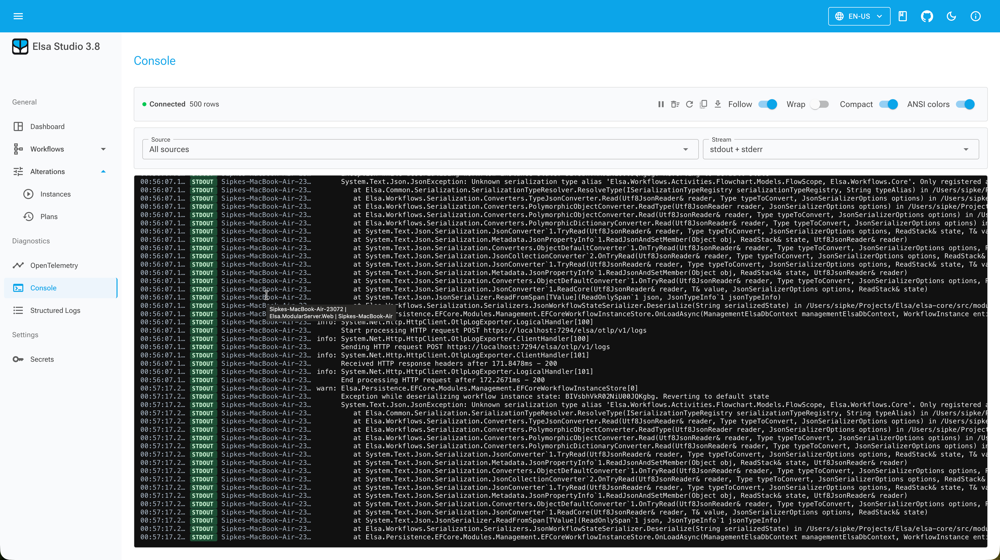

# Console Logs in Elsa 3.8

Not every useful diagnostic signal is a structured log.

Sometimes a process simply writes something to `stdout` or `stderr`, and that is the thing you need to see. It might be an external tool. It might be a library. It might be a quick `Console.WriteLine` while building a workflow. It might be output that already uses ANSI colors and formatting.

Trying to turn all of that into `ILogger` records usually makes the result worse.

Elsa 3.8 preview 1 adds `Elsa.Diagnostics.ConsoleLogs`, an opt-in module for capturing raw console output from the current backend process and showing it in Studio.

It is intentionally separate from structured logs.

## Raw output has different rules

Structured logs have levels, categories, templates, scopes, properties, and exception details. Console output has streams and lines.

That sounds simpler, but it has its own awkward details:

- stdout and stderr need to stay distinct
- the original console destination should still receive the output
- partial writes need to be buffered until a line is complete
- long lines need a maximum length
- ANSI sequences may need to be preserved or stripped
- recent history and subscriber queues need bounds
- dropped lines need to be reported instead of hidden

The Elsa module builds on `ConsoleLogStream.Core` and adds Elsa-specific workflow metadata where available. The capture hook preserves the original stdout and stderr destinations, then sends completed lines through redaction, buffering, and live delivery.

That is important. Turning on diagnostics should not mean the real console suddenly stops behaving like a console.

## The Studio view

Studio adds the console diagnostics page at:

```text
/diagnostics/console
```



The page loads recent console lines and subscribes to live updates. It can filter by source, stream, text, time range, and workflow context.

The module also contributes a workflow instance console tab, so the same raw output can be shown while you are looking at a specific workflow instance. That is often the more useful place for it. If a workflow runs a long process, calls an AI agent, invokes an external executable, or emits progress messages, the operator should not have to leave the instance screen to see what is happening.

## How the backend exposes it

The backend API is small:

```text
POST /elsa/api/diagnostics/console-logs/recent
GET  /elsa/api/diagnostics/console-logs/sources
```

Live updates use SignalR:

```text
/elsa/hubs/diagnostics/console-logs
```

All of this requires:

```text
read:diagnostics:console-logs
```

The module is not durable audit storage. It is not an orchestrator log API. It does not parse lines into semantic fields. It captures recent and live process output so that Studio can show what the process is printing.

That boundary keeps the feature honest.

## Configuration

The basic setup looks like this:

```csharp
services.AddElsa(elsa =>
{
    elsa.UseConsoleLogs(options =>
    {
        options.RecentCapacity = 5_000;
        options.SubscriberCapacity = 1_000;
        options.MaxRecentQuerySize = 1_000;
        options.MaxLineLength = 16_384;
        options.PreserveAnsi = true;
    });
});

app.UseConsoleLogs();
```

Those options say quite a lot about the design.

The recent buffer is bounded. Each subscriber queue is bounded. Recent queries are capped. Lines have a maximum length. ANSI preservation is explicit.

This is the sort of feature where unbounded defaults would be a bug waiting to happen. Console output can be noisy. A tight loop writing lines should not be able to grow server memory forever, and a browser tab should not be asked to render an infinite stream.

When buffers overflow, dropped-line summaries are reported through the console log infrastructure. That gives the UI a way to say "you are seeing a partial stream" instead of silently pretending it kept up.

## ANSI output is not just decoration

ANSI support sounds like a small detail until you look at real console output.

Many command-line tools use color to distinguish errors, warnings, progress, and sections. If Studio strips that by default, the browser view can become less useful than the terminal. If Studio blindly renders every control sequence, that can also be a problem.

Elsa keeps the backend choice explicit with `PreserveAnsi`. Studio then has viewer behavior for rendering or stripping ANSI when needed.

Again, the point is not to make console output into something else. The point is to preserve the useful parts while making it available remotely.

## Where this helps

I expect this to be most useful in fairly practical situations:

- local development with workflows that run background work
- support sessions where someone asks "what did the server just print?"
- workflows that invoke external programs
- AI or agent workflows that emit progress-style output
- distributed task execution where Studio is the operator's main window into runtime behavior

It is less useful for long-term analysis, compliance, or querying across environments. That is not a criticism. It is just the boundary of the feature.

For queryable, semantic application diagnostics, use structured logs. For traces, metrics, resources, and OTLP logs, use the OpenTelemetry diagnostics module or your normal observability stack.

Console logs are the raw stream.

And sometimes the raw stream is exactly what you need.
