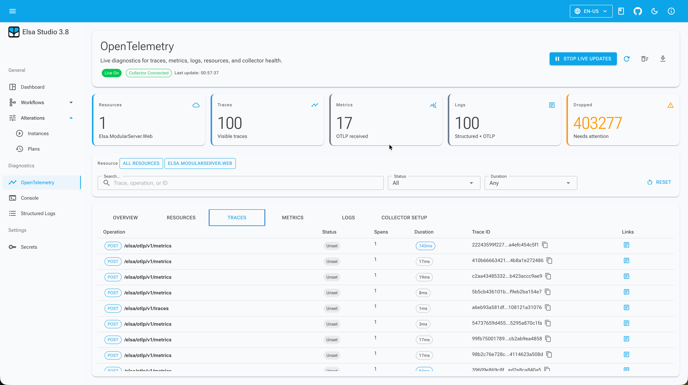

# OpenTelemetry Diagnostics in Elsa 3.8: Local OTLP Viewer

Elsa 3.8 preview 1 has two OpenTelemetry stories. Elsa can produce workflow telemetry through .NET instrumentation, and the new `Elsa.Diagnostics.OpenTelemetry` module can receive recent OTLP telemetry for inspection in Studio ([Elsa 3.8 Preview 1](/blog/elsa-3-8-preview-1), 2026).

Those two ideas should stay separate. The OpenTelemetry Protocol, or OTLP, defines how telemetry such as traces, metrics, and logs is encoded and transported ([OpenTelemetry OTLP specification](https://opentelemetry.io/docs/specs/otlp/), retrieved 2026-06-30). Elsa's diagnostics module is a local OTLP read surface. It is not your long-term observability backend.

> **Key Takeaways**
> - Elsa emits workflow instrumentation through `System.Diagnostics` using the `Elsa.Workflows` activity source and meter.
> - `Elsa.Diagnostics.OpenTelemetry` receives recent OTLP traces, metrics, logs, and resources into a bounded diagnostics store.
> - Studio reads normalized Elsa APIs; it does not parse OTLP protobuf payloads in the browser.

In our experience, this distinction avoids a lot of confusion. "Elsa supports OpenTelemetry diagnostics" does not mean "Elsa replaces your collector, vendor backend, dashboards, retention, and alerting."

## What does Elsa instrument?

Elsa instruments workflow and activity execution through `System.Diagnostics`. Spans are emitted around workflow execution cycles and activity execution, and the meter emits workflow and activity measurements such as `elsa.workflow.started`, `elsa.workflow.completed`, `elsa.workflow.faulted`, and `elsa.activity.duration`.

The default attributes are intentionally conservative. They include identifiers, definition metadata, status, tenant ID when available, and fault status. They do not include workflow input values, activity input values, output payloads, headers, or variable values.

That is the right default for workflow systems. Telemetry should explain execution without turning observability into another place where sensitive or high-cardinality data leaks.

A typical .NET setup still looks like standard OpenTelemetry configuration:

```csharp
services.AddOpenTelemetry()
    .WithTracing(builder => builder
        .AddSource("Elsa.Workflows")
        .AddOtlpExporter())
    .WithMetrics(builder => builder
        .AddMeter("Elsa.Workflows")
        .AddOtlpExporter());
```

If a host needs more detail, it can add its own instrumentation. Elsa's default should stay boring, predictable, and safe.

## How does trace context cross workflow HTTP calls?

Trace context lets downstream services connect their spans to the same distributed trace. Elsa 3.8 injects the current W3C trace context into outbound `SendHttpRequest` and `FlowSendHttpRequest` calls when an active workflow or activity span exists.

That does not replace normal .NET HTTP client instrumentation. You still need the usual instrumentation if you want outbound HTTP spans from the host process.

Elsa's job here is narrower: keep the trace context moving across the workflow boundary. Without that, a workflow can become a trace island even though it is part of a larger request path.

## What does the diagnostics collector receive?

The diagnostics collector receives OTLP HTTP/protobuf telemetry for four signal shapes: resources, traces, metrics, and logs. Core stores recent telemetry in a bounded local diagnostics store and exposes normalized read APIs to Studio.

The default OTLP base path is:

```text
/elsa/otlp/v1
```

with signal-specific endpoints:

```text
POST /elsa/otlp/v1/traces
POST /elsa/otlp/v1/metrics
POST /elsa/otlp/v1/logs
```

For local development, a sender can point at the Elsa host:

```bash
OTEL_SERVICE_NAME=elsa-server
OTEL_RESOURCE_ATTRIBUTES=service.instance.id=local-dev
OTEL_EXPORTER_OTLP_ENDPOINT=http://localhost:5000/elsa/otlp/v1
OTEL_EXPORTER_OTLP_PROTOCOL=http/protobuf
OTEL_BSP_SCHEDULE_DELAY=1000
OTEL_METRIC_EXPORT_INTERVAL=1000
```

If the collector is exposed beyond loopback, configure the API key option. The collector configuration endpoint returns endpoint and required-header names, but tests verify it returns `<configured>` rather than the secret value for `x-otlp-api-key`.

That is the right behavior. Studio can help an operator configure a sender without becoming a secret disclosure surface.

## What does Studio read?

Studio reads Elsa's normalized diagnostics APIs, not raw OTLP payloads. The Core trace search endpoint, for example, is `POST /diagnostics/opentelemetry/traces/search` and requires the OpenTelemetry diagnostics read permission.

The Studio-facing route fragments are:

```text
POST /diagnostics/opentelemetry/resources/search
POST /diagnostics/opentelemetry/traces/search
GET  /diagnostics/opentelemetry/traces/{traceId}
POST /diagnostics/opentelemetry/metrics/search
POST /diagnostics/opentelemetry/logs/search
GET  /diagnostics/opentelemetry/storage
GET  /diagnostics/opentelemetry/collector-configuration
```

Live updates use the diagnostics hub:

```text
/elsa/hubs/diagnostics/opentelemetry
```

Studio adds the page at `/diagnostics/opentelemetry`.



The viewer includes resource search, trace search, trace details, a waterfall layout, metric series rows, OTLP log search, live updates, filters, export behavior, storage diagnostics, and collector configuration.

The filters are not decorative. The Studio tests preserve values such as resource ID, service name, trace ID, workflow instance ID, span status, time range, search text, and result limit when mapping UI state into trace requests.

## Why is local storage bounded?

Local OpenTelemetry diagnostics storage is bounded because telemetry can be high volume. The store has capacity settings for traces, spans, metric points, OTLP log records, and live subscriber queues.

When a buffer exceeds capacity, the oldest item for that signal is dropped and diagnostics counters are incremented. Live feed tests also cover filtered publishing, such as sending only resources and traces that match a selected service name.

This is operational honesty. If the local store is under pressure, Studio should show storage pressure instead of implying the view is complete.

It also keeps the feature scoped. Elsa's local diagnostics collector is useful for local development, preview deployments, demos, and focused support sessions. It is not the place for month-long retention or alerting.

## How does this relate to structured and console logs?

OpenTelemetry diagnostics are the telemetry view. Structured logs are semantic `ILogger` events. Console logs are raw stdout and stderr output.

Those three surfaces can correlate through trace IDs, span IDs, workflow instance IDs, resource values, and time windows, but they should not be collapsed into one generic table.

Use [structured logs](/blog/structured-logs-in-elsa-3-8) when you need categories, templates, scopes, exception fields, and workflow context. Use [console logs](/blog/console-logs-in-elsa-3-8) when you need raw process output. Use OpenTelemetry diagnostics when you need recent traces, metrics, resources, and OTLP logs close to the workflow runtime.

For production observability, keep exporting to your collector or backend of choice. Elsa's local viewer is valuable because it shortens the path from a workflow instance to recent telemetry. It is not valuable because it tries to be everything.
