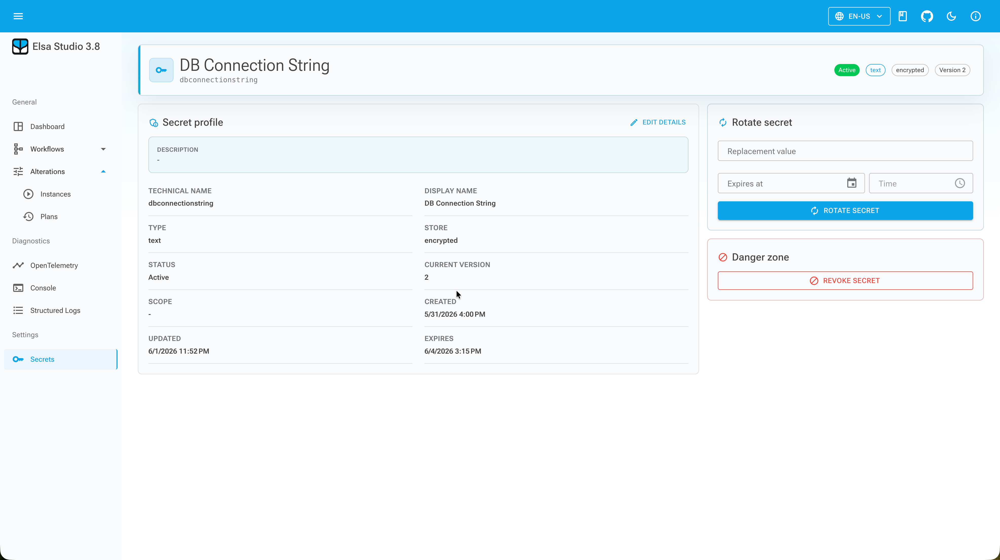

# Secret References in Elsa 3.8: Safer Workflow Inputs

Elsa 3.8 preview 1 adds `Elsa.Secrets`, a first-party model for named secrets, secret references, stores, lifecycle operations, Studio picker support, and runtime resolution ([Elsa 3.8 Preview 1](/blog/elsa-3-8-preview-1), 2026).

The key change is simple: a workflow can store a reference such as `api:key` instead of storing the credential value as ordinary workflow data. That aligns with the general secrets-management principle that secrets should not be hardcoded or copied into places that are easy to export, log, or commit ([OWASP Secrets Management Cheat Sheet](https://cheatsheetseries.owasp.org/cheatsheets/Secrets_Management_Cheat_Sheet.html), retrieved 2026-06-30).

> **Key Takeaways**
> - Elsa 3.8 stores `Secret` expression references in workflow JSON, not the resolved secret value.
> - The Core API supports create, update, rotate, revoke, delete, test, picker, descriptor, and read operations.
> - Studio adds a secrets page and picker flow, but custom activities still need to mark sensitive inputs correctly.

In our experience, the biggest risk is not that a workflow needs a credential. That is normal. The risk is that the credential starts behaving like every other string input in the designer.

## What is a secret reference?

A **secret reference** is a workflow expression value that points to a named secret. In Elsa 3.8, the serialized workflow input can contain an expression of type `Secret` with a value such as `{ "name": "api:key" }`, while the resolved credential stays in the configured secret store.

The test coverage is explicit about this boundary. A workflow input created from `SecretExpression.Create(new("api:key", SecretTypeNames.Text, "production"))` serializes the `Secret` expression and the name `api:key`, and the test asserts that the sample secret value `top-secret` is not present in the JSON.

That is the right product line. Workflow definitions are edited, exported, imported, versioned, reviewed, and sometimes attached to support tickets. They should not become credential containers.

## What does the secret model contain?

An Elsa secret has a logical identity and lifecycle. The model includes a name, display name, description, type, store, optional scope, tags, status, current version, timestamps, and expiration.

The name is the stable reference. The value can rotate behind that name.

For example, a workflow can keep referencing `crm:token`. When the token rotates, the reference can remain stable while the active version changes in the secret store.

That is much better than editing every workflow definition that used the old value. It also gives Studio a place to show status, metadata, versions, rotation, and revocation without showing the secret value as normal field content.

## Which stores does Elsa use?

Elsa 3.8 includes an Elsa-managed encrypted store and a configuration-backed store. The encrypted store is the writable Elsa-managed path. The configuration-backed store lets Elsa reference values that already come from host configuration.

That split is useful in real deployments. Some teams want Elsa to manage a development or tenant-specific secret. Others already source values from environment variables, Kubernetes secrets, Azure Key Vault-backed configuration, Docker secrets, or another host-level provider.

The configuration-backed path keeps those values owned by the host. Elsa can reference and resolve them without pretending Studio should write back to every upstream provider.

The module contracts keep this extensible:

| Contract | Responsibility |
| --- | --- |
| `ISecretManager` | create, update, rotate, revoke, delete, and test |
| `ISecretResolver` | resolve an active value by name |
| `ISecretStore` | provide store-specific read and write behavior |
| `ISecretStoreRegistry` | discover configured stores |
| `ISecretTypeRegistry` | describe supported secret types |
| `ISecretRepository` | persist secret metadata and versions |

## What does the API expose?

The Core API sits under the configured Elsa API prefix and exposes the normal lifecycle operations:

```text
GET    /secrets
GET    /secrets/{name}
POST   /secrets
POST   /secrets/{name}
DELETE /secrets/{name}
POST   /secrets/{name}/rotate
POST   /secrets/{name}/revoke
POST   /secrets/{name}/test
POST   /secrets/picker
GET    /secrets/descriptors
```

The rotate endpoint is a good example of the permission model: `POST /secrets/{name}/rotate` requires the secrets write permission. The wider permission set separates read, write, delete, and test operations.

The test endpoint is worth keeping. It resolves the secret and reports whether resolution succeeded. It does not need to display the secret value to prove that the reference works.

## How does Studio change authoring?

Studio adds the Secrets page at `/security/secrets`. From there, users can search, create, open details, update metadata, rotate, test, revoke, and delete secrets.



The more important authoring feature is the secret picker. Inputs can opt into a `SecretPicker` UI hint, and Studio reads picker options from the input descriptor. That lets an input render a picker instead of a plain text field.

For workflow authors, the effect is straightforward. Instead of pasting a bearer token into an HTTP activity, they select a named secret. The workflow stores the reference, and runtime resolution fetches the active value when the workflow executes.

That is a small UI change with a large operational effect.

## How do scripts resolve secrets?

The `Secret` expression is the preferred path for simple binding. For JavaScript, `Elsa.Secrets.JavaScript` adds `getSecret(name)`:

```javascript
const token = await getSecret("crm:token");
return `Bearer ${token}`;
```

The integration tests show that `getSecret('api:key')` returns a promise-compatible value and records that `api:key` was resolved. Other tests cover `.then(...)` composition and async IIFEs.

Use this when a script genuinely needs to combine a secret with runtime data. Do not resolve a secret just to write it into a variable, activity output, log message, or incident note. Once the value leaves the resolver, it is just a string again.

## What still depends on activity authors?

Secret references reduce the need to store credential values in workflow definitions, but activity authors still need to mark sensitive inputs correctly.

Elsa maps `CanContainSecrets` into input descriptor sensitivity. The test coverage verifies that an activity input marked as sensitive is described as sensitive, while a public input is not.

That matters for custom activities. If an activity accepts an API key, authorization header, connection string, password, private key, webhook secret, or token, treating that field as a normal text input is not good enough.

The secrets module gives Elsa a native contract for safer references. It does not automatically audit every custom activity, stop developers from logging resolved values, or replace host-level secrets policy.

## What should teams do with this preview?

Teams should use the preview to draw a clear boundary between workflow data and credential data. Start by identifying inputs that can contain credentials, then mark those inputs as secret-capable and test the Studio picker flow.

Next, decide which store owns which class of secret. A local encrypted store might be fine for development or isolated runtime values. Host configuration may be better for values already managed by infrastructure.

Finally, review scripts. `getSecret(name)` is useful, but it also makes it easy to turn a protected value back into ordinary text. Keep resolved values close to the call that needs them.

The valuable part of Elsa 3.8 is not just a new settings page. It is the product-level rule that workflows can reference secrets without becoming the place where secrets live.
