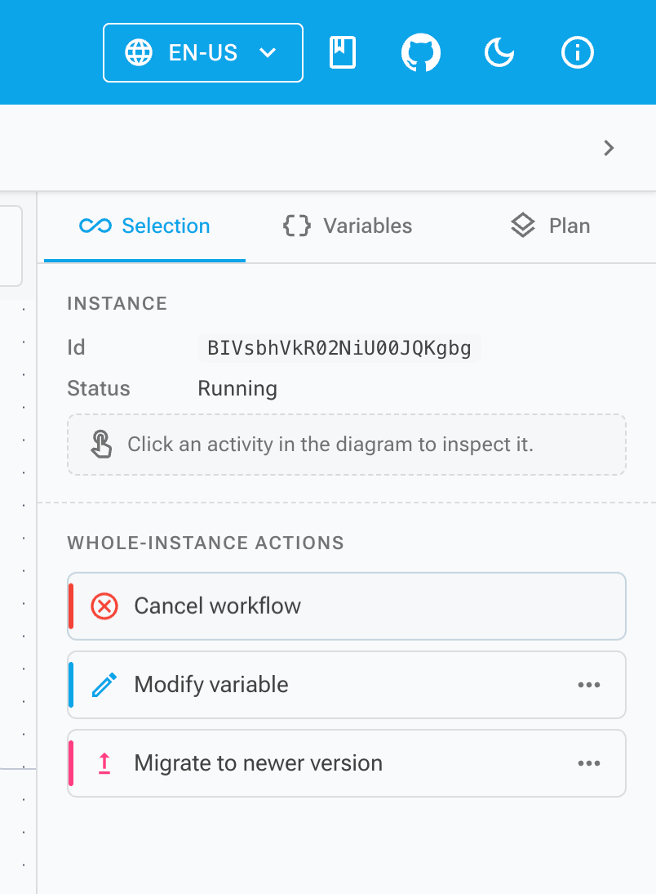

# Workflow Alterations in Elsa 3.8: Runtime Correction

Elsa 3.8 preview 1 adds the Studio experience for workflow alterations, building on the Core alteration model. The point is controlled runtime correction: prepare an alteration, review the target, submit a plan, then inspect jobs and logs ([Elsa 3.8 Preview 1](/blog/elsa-3-8-preview-1), 2026).

Changing a running workflow should never feel casual. Still, real systems need a supported path for cases where the outside world moved on, a variable is wrong, an activity is stuck, or an instance needs to move to a newer definition version.

> **Key Takeaways**
> - Elsa alterations separate intent (`AlterationPlan`) from per-instance execution (`AlterationJob`).
> - The Core API exposes `dry-run`, `run`, `submit`, and `get` operations with `run:alterations` and `read:alterations` permissions.
> - Studio stages alterations before submission, so runtime correction feels like an operational change rather than a random button click.

In our experience, the alternative is usually worse: database edits, restarts, replaying from the beginning, or telling operators that a stuck instance has no supported recovery path.

## What is a workflow alteration?

A **workflow alteration** is an explicit change applied to a running workflow instance. Elsa 3.8 includes built-in alteration types for cancelling a workflow, cancelling an activity, scheduling an activity, modifying a variable, and migrating an instance to a newer version.

The important word is explicit. An alteration is not a hidden state patch. It is a typed operation with a handler, target, plan, job, status, and log.

That gives operators and developers a shared model. You can talk about what was intended, which instances were targeted, what ran, what failed, and what log entries were produced.

## Why split plans from jobs?

Elsa splits alteration intent from execution. An `AlterationPlan` describes the requested changes and target selection. An `AlterationJob` records what happened when that plan was applied to one workflow instance.

That distinction matters whenever a plan targets more than one instance. A single submitted plan can produce several jobs. One job may complete while another fails. The operator needs per-instance status, not one vague result.

The model supports that shape:

| Concept | What it means |
| --- | --- |
| `AlterationPlan` | Intended changes, target filter or instances, plan status, timestamps |
| `AlterationJob` | Execution for one workflow instance |
| `AlterationLog` | Entries produced while applying the alteration |
| Plan status | pending, generating, dispatching, completed, failed |
| Job status | pending, running, completed, failed |

This is the first guardrail. It turns "change the live workflow" into an object you can submit, inspect, and reason about later.

## What does the Core API expose?

The Core API exposes four main route fragments under the configured Elsa API prefix:

```text
POST /alterations/dry-run
POST /alterations/run
POST /alterations/submit
GET  /alterations/{id}
```

`dry-run` finds workflow instance IDs that match the target filter. It validates timestamp filters and returns the matched IDs without applying the alterations.

`run` applies alterations directly to explicit workflow instance IDs. `submit` stores a plan and schedules it through the alteration plan scheduler. `get` loads a plan and the jobs created for it.

The mutable operations require:

```text
run:alterations
```

Reading a plan requires:

```text
read:alterations
```

Those permissions are not decoration. Alterations can cancel running work, schedule activity execution, change variables, and migrate instances. They deserve separate operational access.

## Which alterations are built in?

Studio's alteration catalog exposes five built-in operations. The catalog names are intentionally direct:

- `Cancel`: cancel the entire workflow instance.
- `CancelActivity`: cancel a specific running activity.
- `ScheduleActivity`: schedule a specific activity for execution.
- `ModifyVariable`: set a workflow variable to a new JSON value.
- `Migrate`: move the running instance to a newer published workflow version.



The `ModifyVariable` operation asks for a variable and a JSON value. `Migrate` asks for a target version. Activity-targeted operations use the selected activity context.

That catalog is deliberately small. It covers common correction paths without pretending that every possible state mutation should be available from the UI.

## How does Studio stage a change?

Studio adds pages for alteration plans, workflow instance selection, plan details, and instance editing. The designer side adds an alteration catalog, staging service, side panel, configuration dialog, and submit dialog.

The staging service is scoped to the editor session. It keeps a list of staged alterations, supports add, update, remove, clear, and counts staged items for a target activity.

That produces a deliberate flow:

1. Find or inspect the workflow instance.
2. Add one or more alterations from the catalog.
3. Configure their fields.
4. Review the staged changes.
5. Submit the alteration plan.
6. Inspect the plan, jobs, statuses, and logs.

The submit flow opens an "Submit alteration plan" dialog with the workflow instance ID and staged items. After a successful submit, Studio clears the staging service so the editor does not keep stale pending changes.

That detail matters. An operator should not return to an edit surface that still looks ready to submit an already-submitted correction.

## What guardrails should teams add?

Alterations give Elsa a supported path for correction. They do not replace process.

At minimum, teams should decide who can run alterations, which environments allow them, which alteration types are acceptable, and how plan/job logs are reviewed after use.

Good diagnostics also matter. Before changing runtime state, operators need enough context to know why the instance is stuck. After changing it, they need enough context to verify what happened. Pair alterations with [structured logs](/blog/structured-logs-in-elsa-3-8), [console logs](/blog/console-logs-in-elsa-3-8), and [OpenTelemetry diagnostics](/blog/opentelemetry-diagnostics-in-elsa-3-8) where those signals help.

Also be conservative with variable changes. A JSON value can be syntactically valid and still be semantically wrong for the workflow. Runtime correction should be reviewed like any other operational change.

## When should alterations be used?

Use alterations when the workflow instance is still valuable and the correction is narrower than a restart, replay, manual database patch, or full incident workaround.

Good candidates include cancelling an activity that should no longer wait, scheduling an activity after an external event already happened, correcting a variable that blocks progress, or migrating an instance after a safe definition change.

Poor candidates include routine business logic, missing retry design, missing compensation design, or ad hoc experiments in production. If the same alteration is needed repeatedly, the workflow design probably needs attention.

The useful part of Elsa 3.8 is the product shape: typed alterations, plans, jobs, logs, permissions, a staged Studio workflow, and a small catalog of common operations. That is a better foundation than telling teams to patch workflow state by hand.
