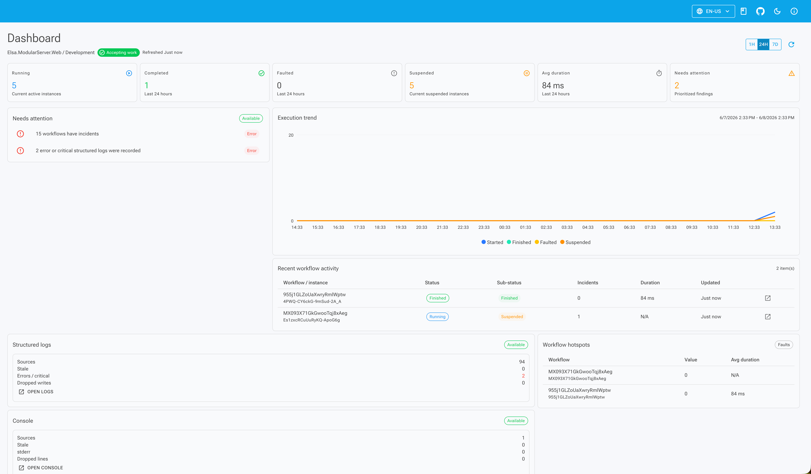

# Elsa Studio Dashboard: Split on Purpose

Elsa 3.8 turns the Studio home page into an operational dashboard. More importantly, it does so with a split architecture: the dashboard module owns the shell and widget contracts, while workflow and diagnostics modules contribute their own data and widgets.

The work landed across both repositories:

- [`elsa-core` PR #7681](https://github.com/elsa-workflows/elsa-core/pull/7681) added the Dashboard API.
- [`elsa-core` PR #7690](https://github.com/elsa-workflows/elsa-core/pull/7690) refactored the API around contributors.
- [`elsa-core` PR #7692](https://github.com/elsa-workflows/elsa-core/pull/7692) extracted dashboard contributors into companion modules.
- [`elsa-studio` PR #871](https://github.com/elsa-workflows/elsa-studio/pull/871) replaced the old Studio home.
- [`elsa-studio` PR #879](https://github.com/elsa-workflows/elsa-studio/pull/879) refactored dashboard widgets.
- [`elsa-studio` PR #887](https://github.com/elsa-workflows/elsa-studio/pull/887) added feature-gated dashboard widget composition.

> **Key Takeaways**
> - Studio now has dashboard zones for metrics, findings, primary panels, diagnostics status, and secondary panels.
> - Core uses dashboard contributors so workflow and diagnostics modules own their own dashboard data.
> - Studio companion modules are remote-gated, so widgets appear only when the selected backend advertises the matching feature.

In our experience, that split is the difference between a dashboard that can grow and a dashboard that slowly becomes a pile of conditional branches.

## What changed in Studio?

The old Studio dashboard was effectively a placeholder. The new dashboard has a backend label, runtime status, last-refreshed state, time-range controls, refresh action, and widget zones.

The default widget set includes workflow metrics, needs-attention findings, workflow trends, recent activity, workflow hotspots, structured logs, and console logs. That means the dashboard now connects directly to workflow runtime state and diagnostics state.



The default Studio hosts register the dashboard shell plus companion modules such as `AddWorkflowsDashboardModule`, `AddConsoleLogsDashboardModule`, and `AddStructuredLogsDashboardModule`. That is why the dashboard feels complete out of the box without making the shell module own every data source.

## Why is the dashboard split?

The **dashboard shell** owns the route, layout, widget zones, refresh/range state, shared widget context, and rendering surface. It should not own workflow metrics, console log summaries, structured log summaries, or every future package's dashboard data.

The test suite protects that boundary. Owner projects for workflows, structured logs, and console logs do not reference `Elsa.Studio.Dashboard` directly. Companion dashboard modules do the integration work.

That matters because dashboards attract scope. Workflow wants metrics. Diagnostics wants status. Package authors want health cards. Platform modules want queue pressure or tenant status. If one dashboard module imports everything, it becomes the next monolith.

The split keeps ownership where it belongs:

| Area | Owns |
| --- | --- |
| `Elsa.Studio.Dashboard` | dashboard shell, zones, shared contracts |
| workflow dashboard companion | workflow widgets |
| console logs dashboard companion | console log widgets |
| structured logs dashboard companion | structured log widgets |
| Core Dashboard API | public dashboard routes, permissions, range resolution, contributor orchestration |
| Core feature contributors | feature-specific dashboard data |

## How does Core mirror the split?

Core uses dashboard contributors. `Elsa.Dashboard.Api` owns public `/dashboard/*` routes, read permissions, range resolution, and contributor orchestration. Feature modules own the data they contribute.

For example, the overview endpoint is `GET /dashboard/overview` and requires the dashboard read permission. The workflow dashboard contributor computes running, completed, faulted, suspended, interrupted, incident-bearing, and average-duration metrics from workflow instance summaries.

Diagnostics modules contribute their own dashboard slices. The console logs contributor counts sources, stale or disconnected sources, recent stderr lines, and dropped lines. If console log data is unauthorized or unavailable, it returns that state as dashboard capability data instead of failing the entire dashboard.

That failure isolation is important. One diagnostics contributor should not take down the whole operational surface.

## What does feature gating protect?

Studio companion modules declare remote backend feature names. The tests verify three of them:

```text
Elsa.Workflows.Runtime.Dashboard.ShellFeatures.WorkflowRuntimeDashboard
Elsa.Diagnostics.StructuredLogs.Dashboard.ShellFeatures.StructuredLogsDashboard
Elsa.Diagnostics.ConsoleLogs.Dashboard.ShellFeatures.ConsoleLogsDashboard
```

That gives Studio a clean answer to a common modular-host problem: the UI package may be installed while the selected backend does not support the corresponding data.

The answer is not to render a broken card. The companion feature initializes when the backend advertises the matching capability. Otherwise, the dashboard shell remains coherent and the unsupported slice stays out of view.

That pairs naturally with the shell-feature model described in [Configuring Elsa with Shell Features](/blog/configuring-elsa-with-shell-features).

## Why does this matter for diagnostics?

The dashboard now makes diagnostics visible without merging every diagnostics surface into one page. Structured logs, console logs, and OpenTelemetry still keep their dedicated views. The dashboard gives operators status and navigation.

For example, a dashboard card can show stale console log sources or dropped lines, then point the operator to [Console Logs in Elsa 3.8](/blog/console-logs-in-elsa-3-8). A structured logs card can summarize availability or pressure, then point to [Structured Logs in Elsa 3.8](/blog/structured-logs-in-elsa-3-8).

That is the right level for a dashboard. It should tell you where to look, not replace every investigative surface.

## What should extension authors copy?

Extension authors should copy the ownership pattern, not just the UI shape. Put shared shell behavior in the dashboard module. Put feature-specific data loading, widgets, and backend capability requirements in companion modules.

If a module owns queue health, let that module contribute queue health. If a package owns a runtime integration, let that package contribute its dashboard slice. Keep the dashboard shell boring.

For most users, the headline is simpler: Elsa Studio now has a dashboard that deserves the name. For teams extending Studio, the more important point is that the dashboard got better without becoming a central dependency for every module that wants to be seen.
