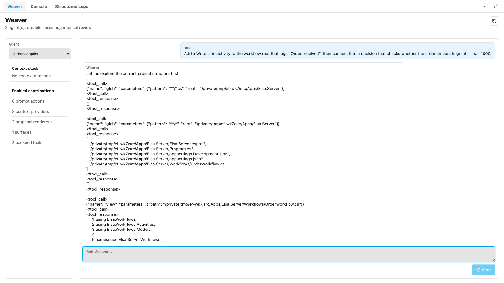
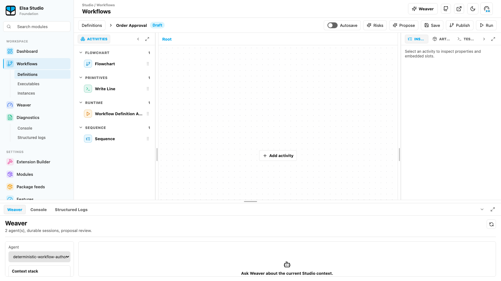

> **Key Takeaways**
> - Week 7 (2026-06-19 → 2026-06-26) shipped two powerful authoring surfaces — the **Weaver** AI workflow assistant ([PR #140](https://github.com/elsa-workflows/elsa-foundation/pull/140)) and the Git-first **Extension Builder** ([PR #97](https://github.com/elsa-workflows/elsa-foundation/pull/97)).
> - Most of the week's 28 merged foundation PRs and 20+ new ADRs went into the *trust boundary*: Elsa owns risk classification, edits are undoable, and builds run out-of-process.
> - The connective thesis across both initiatives is one architectural stance — **Elsa owns the safety envelope** — and decisions are defined as much by what they rule out as what they allow.

## Where we are on the road

Last week was about the floor: drawing the persistence boundary so design state lives in Groundwork instead of leaking through the runtime. This week we built the first powerful *authoring* surfaces on top of that floor — and then spent most of our time deciding how to keep them safe.

Two things landed. **Weaver**, the Studio AI assistant, can now directly construct and modify workflows. And **Extension Builder** turned into a Git-first online .NET editor. Both are the kind of capability that sells a product and sinks one if it goes wrong. So the real story of week 7 is not "we added AI." It is how Elsa gives away authoring power without giving up control.

## The headline decision: Weaver can edit your workflow, but Elsa owns the safety envelope

Weaver shipped as a workflow-authoring MVP this week ([PR #140](https://github.com/elsa-workflows/elsa-foundation/pull/140), merged 2026-06-25), and it can directly build and change workflow definitions. The interesting part is not that it can — it is the three architectural decisions that constrain *how*. The forcing function is simple: a modern agent harness can own shells, filesystems, MCP servers, memory, and sub-agents. The problem was never capability. It was trust.

*Weaver's GitHub Copilot agent provider in Elsa Studio, exploring the workspace with `glob` and `view` tool calls — the raw harness capability that Decision one keeps behind Elsa-owned, review-first proposals. Captured from a local build of the Week 7 studio commit (`elsa-foundation-studio@aca0542`).*

**Decision one — mediation.** A [DeerFlow-class agent harness can do almost anything, but Studio must not expose those raw capabilities to users](https://github.com/elsa-workflows/elsa-foundation/blob/main/docs/adr/0001-mediate-agent-harness-capabilities.md). As the ADR puts it, "Elsa-owned tools and review-first proposals remain the product trust boundary so filesystem, shell, MCP, memory, and business operations are scoped, auditable, permissioned, and reversible where possible." The harness is an engine, not a steering wheel.

**Decision two — undoable apply.** "Direct apply" sounds dangerous; it isn't, because of [ADR 0002](https://github.com/elsa-workflows/elsa-foundation/blob/main/docs/adr/0002-direct-weaver-workflow-edits-target-designer-working-state.md). Weaver updates the **visible designer working state as an undoable transaction**, not silently committing persisted draft state. The designer stays responsible for undo/redo, validation, dirty-state tracking, and the save/publish flow. Weaver accelerates authoring; it never bypasses your control over durable changes. That deliberately **rules out** silent persisted-draft writes.

**Decision three — Elsa-owned risk classification.** A provider may emit risk hints, but [Elsa owns provider-neutral risk classification for graph edits](https://github.com/elsa-workflows/elsa-foundation/blob/main/docs/adr/0003-weaver-direct-apply-risk-classification-is-elsa-owned.md). The backend classifies generated operation batches before returning them; Studio rechecks against live designer working state before applying; and "any disagreement or uncertainty fails closed into clarification or proposal instead of direct apply." This **rules out** trusting a provider's own assessment of how risky its edit is.

Those decisions ride on a deterministic contract chain, not vibes. A [workflow graph operation batch contract](https://github.com/elsa-workflows/elsa-foundation/pull/136) (#136) defines the provider-neutral edit intents; the backend [returns deterministic batches](https://github.com/elsa-workflows/elsa-foundation/pull/137) (#137); [context is minimized](https://github.com/elsa-workflows/elsa-foundation/pull/138) before it reaches the provider (#138); and the result is [applied to the designer draft](https://github.com/elsa-workflows/elsa-foundation/pull/139) (#139). The Studio surface for all of this arrived as the [Weaver assistant MVP](https://github.com/elsa-workflows/elsa-foundation-studio/pull/26) (Studio #26).

*The Week 7 workflow designer (`elsa-foundation-studio@aca0542`) on a draft definition. The toolbar's **Risks** and **Propose** actions are the designer-side surface of the risk-classification and review-first apply flow described above; the Weaver panel is docked underneath.*

A naming note worth pinning, because it is a decision in disguise. The [agentic Studio spec](https://github.com/elsa-workflows/elsa-foundation-studio/blob/main/specs/003-agentic-studio-experience/spec.md) states the visible assistant is **Weaver**, while "agent" stays internal vocabulary for backend profiles and provider-neutral contracts. In the [glossary](https://github.com/elsa-workflows/elsa-foundation/blob/main/docs/glossary/elsa.md), a *workflow graph operation* is "a provider-neutral workflow-design edit intent… Agent providers may generate graph operations, but workflow design owns their meaning and the designer owns their application to working state." The product is Weaver; the plumbing is provider-neutral; and design owns meaning. That separation is what lets a second AI provider plug in later without each one re-litigating "safe."

## Extension Builder: a Git-first .NET editor with a deliberately small blast radius

The second authoring surface is for code, not workflows. The [Extension Builder backend pipeline](https://github.com/elsa-workflows/elsa-foundation/pull/97) (#97, merged 2026-06-23) plus its [Studio UI](https://github.com/elsa-workflows/elsa-foundation-studio/pull/23) (Studio #23) and [centralized build polling](https://github.com/elsa-workflows/elsa-foundation-studio/pull/24) (Studio #24) turn a workspace into one checked-out Git repository you edit in the browser. A 19-strong ADR series fences in exactly what that editor may do — and the right way to read it is as *one* decision about blast radius, not nineteen.

- **Git identity** ([ADR 0001](https://github.com/elsa-workflows/elsa-foundation/blob/main/docs/adr/0001-extension-builder-git-identity.md)): remote operations use user-owned Git provider authorization as the primary path, with an admin-managed bot identity only as a fallback. Per-workspace raw tokens are explicitly avoided, and the UI must make the active Git actor visible before a push.
- **Safety envelope** ([ADR 0004](https://github.com/elsa-workflows/elsa-foundation/blob/main/docs/adr/0004-extension-builder-git-safety-envelope.md)): v1 supports status, diff, stage, unstage, commit, create branch, push, and pull *only when the working tree is clean*. It blocks force push, hard reset, rebase, interactive conflict resolution, and dirty-tree pulls — and the ADR insists "the backend must enforce these limits; hiding controls in the UI is not sufficient."
- **Build execution boundary** ([ADR 0009](https://github.com/elsa-workflows/elsa-foundation/blob/main/docs/adr/0009-extension-builder-build-execution-boundary.md)): repository code is treated as untrusted. Restore, build, test, and pack run **outside the Elsa Server host process** in an isolated worker with workspace roots, timeouts, cancellation, and log streaming. Build success never auto-installs a package; promotion stays a separate explicit action.
- **v1 editor scope** ([ADR 0012](https://github.com/elsa-workflows/elsa-foundation/blob/main/docs/adr/0012-extension-builder-v1-editor-scope.md)): Monaco editing, repo/solution/project navigation, file CRUD, build-backed diagnostics, and template-driven creation. It explicitly does **not** promise IntelliSense, semantic refactoring, a debugger, an integrated terminal, or a full NuGet manager.

Contrast that with Elsa 3, where building an extension was an out-of-band developer concern handled in your own IDE. Here, authoring becomes a first-class, bounded product surface — and the boundaries are written down in the [backend spec](https://github.com/elsa-workflows/elsa-foundation/blob/main/specs/075-extension-builder-backend/spec.md) and the [Studio UI spec](https://github.com/elsa-workflows/elsa-foundation-studio/blob/main/specs/003-extension-builder-studio-ui/spec.md) before the polish. A [working copy](https://github.com/elsa-workflows/elsa-foundation/blob/main/docs/glossary/elsa.md) is "a server-side Git checkout/clone for a specific user, session, or branch," and new edit sessions default to an explicit working branch rather than silently editing the default branch.

## Runtime evidence you can trust: checkpoint commit and activity execution inspection

Inspection is only worth anything if it reflects what *durably* happened, so [activity execution inspection](https://github.com/elsa-workflows/elsa-foundation/pull/111) (#111) was wired this week to commit through the new [runtime checkpoint commit store](https://github.com/elsa-workflows/elsa-foundation/pull/113) (#113), both merged 2026-06-25.

[ADR 0020](https://github.com/elsa-workflows/elsa-foundation/blob/main/docs/adr/0020-runtime-checkpoint-commit-post-commit-work.md) is the cleanup that makes this honest. Runtime checkpoint commit "applies a named checkpoint's state changes and records any post-commit delivery work, but it does not dispatch that work inline." Delivery stays in a separate outbox processor. The shallow `IRuntimeCheckpointWriter` is replaced by the narrower `IRuntimeCheckpointCommitStore`, and a skipped commit that still carries post-commit intents is reported as a failed commit rather than silently dropped. The decision **rules out** mixing persistence with inline delivery — the thing that previously forced tests to fake writer, dispatcher, outbox, policy, and timing seams for one behavior.

The [checkpoint-gated inspection ADR](https://github.com/elsa-workflows/elsa-foundation/blob/main/docs/adr/0001-checkpoint-gated-activity-execution-inspection.md) (status: proposed) closes the loop: inspection projections are committed **in the same checkpoint** before dependent scheduler work is enqueued, "because instance inspection must reflect committed runtime evidence and recovery must not observe scheduler work for activity state that was never durably committed." Both pieces are explicitly tracked under the [runtime execution seam](https://github.com/elsa-workflows/elsa-foundation/blob/main/docs/program-goals/runtime-execution-seam.md) program goal, whose objectives 10 and 11 name [spec 079](https://github.com/elsa-workflows/elsa-foundation/blob/main/specs/079-activity-execution-inspection/spec.md) and [spec 080](https://github.com/elsa-workflows/elsa-foundation/blob/main/specs/080-runtime-checkpoint-commit/spec.md) directly. A [seam](https://github.com/elsa-workflows/elsa-foundation/blob/main/docs/glossary/elsa.md), in Elsa's own vocabulary, is "a published contract boundary between sub-domains" — and this week added two more clean ones.

## What this unlocks next

The week's decisions are setup, not endpoints. Weaver's batch contract plus Elsa-owned classification means the *next* AI provider plugs into a stable seam without redefining what "safe" means — the trust boundary is owned once, centrally. Extension Builder's out-of-process build worker reserves room for container or remote build implementations behind the same boundary, and leaves Roslyn/LSP intelligence, a debugger, and NuGet management as honest, separate work units rather than v1 promises. And the checkpoint commit store plus inspection projections are the substrate for trustworthy workflow instance inspection in Studio, which already started moving with the [workflow instance detail canvas](https://github.com/elsa-workflows/elsa-foundation-studio/pull/32) (Studio #32) and [designer draft test runs](https://github.com/elsa-workflows/elsa-foundation-studio/pull/28) (Studio #28). Underneath it all, design persistence now [runs on Groundwork](https://github.com/elsa-workflows/elsa-foundation/pull/103) (#103) feeding a [package-first module registry](https://github.com/elsa-workflows/elsa-foundation/pull/105) (#105).

## This week by the numbers

- **foundation:** 74 non-merge commits, 28 merged PRs, 880 files changed (+30,136 / −3,898), 20+ new ADRs, 7 new spec slices.
- **studio:** 38 non-merge commits, 14 merged PRs, 2 new spec slices.
- **Window:** 2026-06-19 → 2026-06-26.

If you read one thing this week, read one of these:

- [ADR 0003 — Weaver direct-apply risk classification is Elsa-owned](https://github.com/elsa-workflows/elsa-foundation/blob/main/docs/adr/0003-weaver-direct-apply-risk-classification-is-elsa-owned.md)
- [ADR 0004 — Extension Builder Git safety envelope](https://github.com/elsa-workflows/elsa-foundation/blob/main/docs/adr/0004-extension-builder-git-safety-envelope.md)
- [ADR 0020 — Runtime checkpoint commit records post-commit work without inline delivery](https://github.com/elsa-workflows/elsa-foundation/blob/main/docs/adr/0020-runtime-checkpoint-commit-post-commit-work.md)

## Follow along

- **Foundation repo:** [elsa-workflows/elsa-foundation](https://github.com/elsa-workflows/elsa-foundation)
- **Studio repo:** [elsa-workflows/elsa-foundation-studio](https://github.com/elsa-workflows/elsa-foundation-studio)
- **The constitution:** [.specify/memory/constitution.md](https://github.com/elsa-workflows/elsa-foundation/blob/main/.specify/memory/constitution.md)
- **The glossary:** [docs/glossary/elsa.md](https://github.com/elsa-workflows/elsa-foundation/blob/main/docs/glossary/elsa.md)
