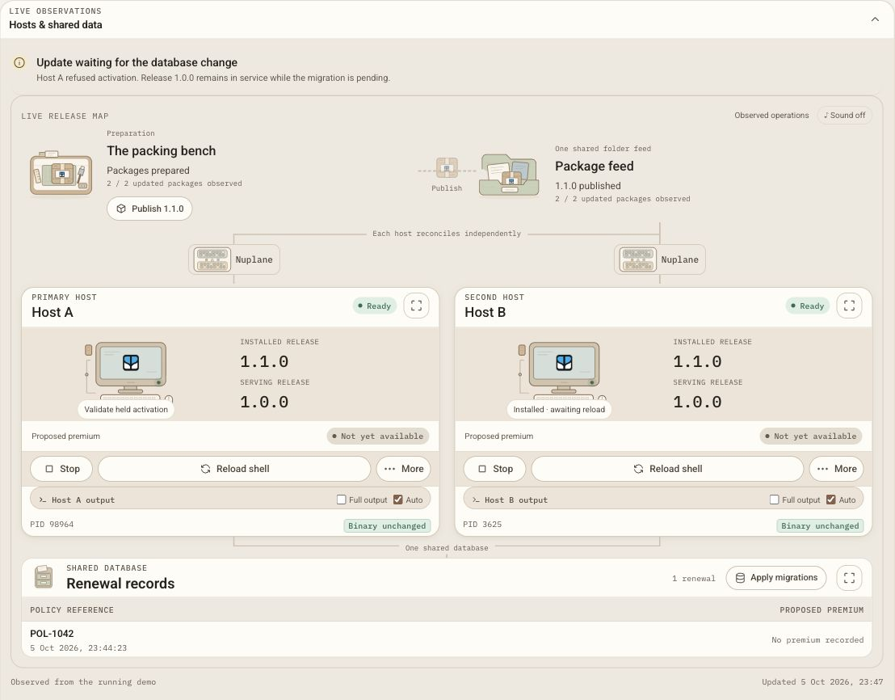
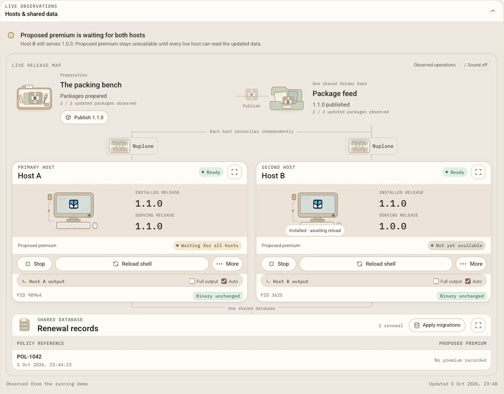
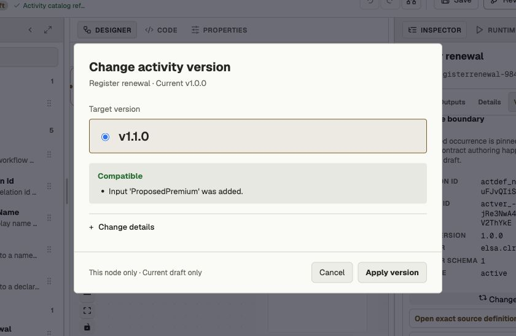
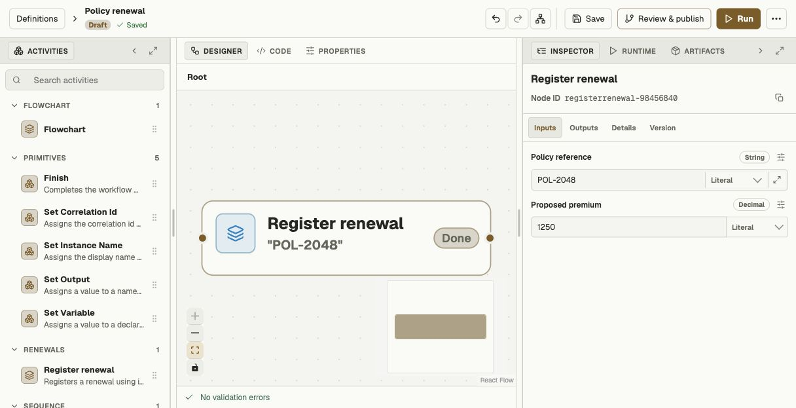
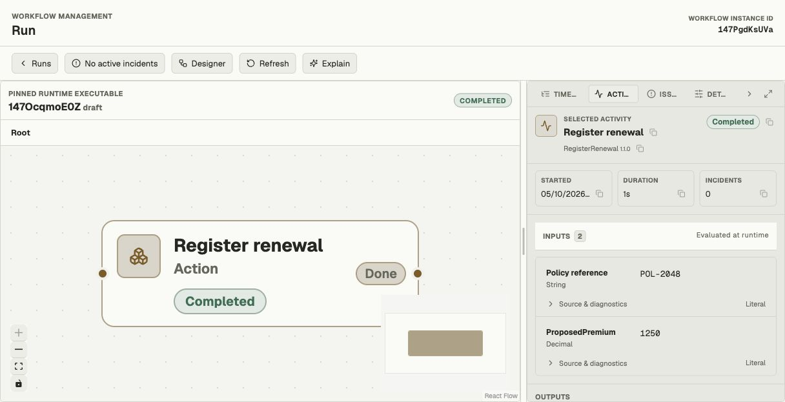
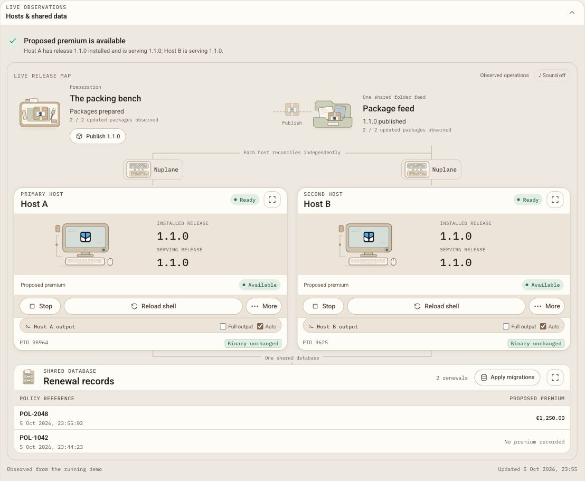

# Updating Elsa 4 Modules Without Restarting the Host

We want to deploy module updates reliably while our servers keep running. That gets more interesting when the new code also needs a database change.

Installing the package is only part of the job. The new code needs a schema it can use, and the other servers may still be running the previous release. If you switch too early, a perfectly good package can become a broken deployment.

Elsa 4 can reload module code inside a running .NET host. Package delivery, database migration and activation are separate steps, so acquiring an update does not have to mean switching to it immediately. If the database is not ready, activation can be refused while the previous release keeps serving.

These capabilities belong to the evolving [Elsa 4 / Foundation codebase](https://github.com/elsa-workflows/elsa-foundation). Elsa 4 is still under development. The mechanisms described here are useful to understand when designing modules and planning updates; they are not an announcement of a stable release.

## Start with the refusal

Consider two running hosts, A and B, sharing a database and a package feed. Both start on module release `1.0.0`.

Publish the `1.1.0` packages once to that shared feed. Each host reconciles independently through Nuplane. Both can report `1.1.0` as installed while their shells still serve `1.0.0`.

Installed and serving are different states.

With the migration policy set to `Validate`, attempting to activate the new release checks the database first. If a required EF module migration is missing, the shell reload is refused with HTTP 409. The response identifies the pending migration, and the previous shell stays active.

That is the behavior I care about here. A refused activation is useful when it tells you what is missing and leaves the working release in place.

*Both hosts have installed the update, but still serve `1.0.0`. Validate has held A's activation until the migration is applied.*

Applying the migration is an explicit operation. Reloading a shell is another explicit operation. `Validate` does not quietly apply the migration for you, and installing the package does not mean its new code is already serving requests.

## Adding an optional input

To make the change easy to follow, the sample module has a **Register renewal** activity. The original contract accepts a policy reference. Release `1.1.0` adds an optional `ProposedPremium` input and a nullable numeric column in the database.

The module release moves from `1.0.0` to `1.1.0`; the schema family moves from `1.0.0` to `2.0.0`. Those version numbers describe different things. A package version is not a database schema version.

For SQLite, the example's migration adds a nullable `numeric(18,2)` column. Existing renewal rows keep their identifiers, references and creation timestamps. Their premium remains `null`. Leaving the optional premium empty also means `null`, not zero. Zero would be a recorded amount; empty means no amount was supplied.

There is nothing special about renewals in this mechanism. It is a small example of a module acquiring a new input and a new storage requirement.

## The host does not need rebuilding

[`Foundation.Host`](https://github.com/elsa-workflows/elsa-foundation/blob/5be960a1becf8e2b2bd8c2bb09ab60aa182962b3/src/apps/Elsa.Foundation.Host/Elsa.Foundation.Host.csproj) has no build-time references to the Elsa feature implementations. It still references shared contracts and host infrastructure. Nuplane acquires the feature packages and custom module packages at runtime. That includes capabilities such as workflows and authentication.

The host supplies the foundation for composition; the packages supply the capabilities. A shell is the active composition of those capabilities inside the host.

To update a module, replace its packages and explicitly reload that composition. The host binary does not need rebuilding or replacing for this kind of update, and the host process stays running while its active shell composition changes.

That is module hot reload: new module code in the same running host process. It does not mean the host can accept any arbitrary change, or that everything already executing has automatically moved to the new code.

## A column can exist before the feature is ready

After the migration, we reload A. It starts serving module `1.1.0`, while B still serves `1.0.0`.

The new column now exists. The premium feature on A is still dormant.

*After migration and A's reload, the older B reader still holds the feature back. The original renewal remains visible.*

A looks ready if you only watch its package version and the new database column.

B is still a live reader that advertises only schema-family version `1.0.0`. The additive migration can coexist with it, but the family stays finalized at `1.0.0` until every counted reader can handle `2.0.0`. That keeps the premium feature dormant and prevents new `2.0.0` writes during the mixed period. A nullable column alone does not make the older reader compatible with the new contract.

The [schema compatibility mechanism](https://github.com/elsa-workflows/elsa-foundation/blob/5be960a1becf8e2b2bd8c2bb09ab60aa182962b3/src/essentials/Persistence/EntityFramework/SchemaFinalization/EfSchemaModuleGate.cs#L613-L628) tracks the active readers and their advertised compatibility. In the sample, fleet readiness gates schema finalization and availability of the premium feature. A serving the newer package is not enough. Both hosts must advertise compatible active readers before the feature becomes usable.

The sequence looks like this:

| Point in the update | A serves | B serves | Premium feature |
| --- | --- | --- | --- |
| Update installed, migration missing | `1.0.0` | `1.0.0` | Unavailable; new activation refused |
| Migration applied, A reloaded | `1.1.0` | `1.0.0` | Dormant; older reader still present |
| B reloaded and compatible readers reported | `1.1.0` | `1.1.0` | Ready after schema finalization |

B already installed the package from the same publication. We reload its shell without publishing again. Once both readers are compatible, the gate can open.

I find this distinction useful: preparing the database, activating code and enabling schema-dependent behavior do not have to happen at the same instant.

This example uses an additive migration. A destructive change, such as dropping a column still used by old code, needs its own compatibility and rollout plan. Schema compatibility checks do not make every schema change safe to run with older readers present.

## Studio makes the contract change explicit

The package update does not silently upgrade the nodes in a workflow.

In Studio, we refresh the activity catalog, select the Register renewal node, and explicitly change that occurrence to contract `1.1.0`. The optional Proposed premium input then becomes available. After fleet readiness is green, we enter `1250`, save and publish the workflow, then run Studio's draft test.

*The refreshed catalog preserves the original contract. Applying `1.1.0` changes this occurrence in the current draft.*

*The upgraded occurrence exposes the optional decimal input.*

The linked draft test completes and creates a row with a numeric premium of `1250`. The earlier row remains intact. This activity creates another renewal record each time it runs, even when the policy reference is the same.

*Studio's linked draft test shows contract `1.1.0`, the evaluated premium and zero incidents.*

*Both shells now serve the update. `POL-1042` retains its original timestamp and empty premium; `POL-2048` records the new amount.*

Refreshing the catalog and changing a node's contract are separate choices. Refresh makes the new descriptor available; it does not rewrite the existing node.

## An activity contract is not a package binding

There is another boundary here that is easy to miss.

An activity node can retain contract `1.0.0` after the module has been updated. In this example, the old contract can run against the newer implementation because the original input is preserved and the premium is optional.

But that is compatibility with newer code. It is not proof that the runtime retained the old binary for that node.

The current CLR activity resolver uses one locally registered class per activity alias. A node's semantic contract version does not select a side-by-side package implementation. After the update, a node still using the older contract can execute the currently loaded newer class.

The reverse direction deserves care too. If a newer contract containing `ProposedPremium` is dispatched to an older worker, that worker's activity class has no corresponding property. The [current hydration path](https://github.com/elsa-workflows/elsa-foundation/blob/5be960a1becf8e2b2bd8c2bb09ab60aa182962b3/src/essentials/Activities/Runtime/Services/ActivityInputHydrator.cs#L33-L36) can fail when a contract input has no matching property on the locally loaded class.

The schema gate does not provide capability-aware worker routing. It checks schema compatibility, not whether a particular worker has the activity inputs needed by a particular execution.

[Foundation issue #2312](https://github.com/elsa-workflows/elsa-foundation/issues/2312) records the gap between a pinned activity contract and the locally loaded class, and asks for missing-input diagnostics before execution. Binding a node to a retained package release, or dispatching only to workers with the required capabilities, are possible enhancements rather than guarantees of the current contract-versioning mechanism.

If you maintain custom activities, preserving the old contract is therefore still your responsibility when replacing an implementation in place. Removing or renaming inputs is a different kind of update from adding an optional one.

## Compatibility still needs a rollout plan

Hot reload removes the need to restart the host process for compatible module updates. It does not replace deployment design.

Migration scripts remain provider-specific. The SQLite column in this example says nothing about how another database provider will execute or lock during its migration. Plan and verify that behavior for the provider you use.

In-flight workflow behavior, service continuity under load and destructive schema changes need their own compatibility decisions and verification. A running host process alone is not a guarantee of uninterrupted service. Neither package installation nor catalog refresh automatically upgrades workflow nodes.

What I want from a module update is a clear answer at each step: the package is installed, the schema is ready, this shell is serving the new release, and the fleet can use the new feature. When one of those conditions is missing, I want the system to say so while the previous release keeps doing its job.

Those are separate states, and keeping them visible makes a module update much easier to reason about.
